# GitHub Streak & Stats Generator

Automated GitHub Action that tracks your **lifetime contribution data** (not just the last year) and generates **dynamic streak SVG images**.

---

## Theme Showcase

These stats are generated automatically every day. All themes are **Adaptive**, meaning they automatically switch colors based on your system's Light/Dark mode settings.

<p align="center">
  <strong>1. Ocean Blue</strong><br/>
  
</p>

<p align="center">
  <strong>2. Forest Green</strong><br/>
  
</p>

<p align="center">
  <strong>3. GitHub Classic</strong><br/>
  
</p>

---

## How to Add This to Your Profile

You can easily add these stats to your **GitHub Profile README** using this template repository.

---

## Step 1: Create Your Repository from This Template

1. Click **Use this template** at the top of this repository.
2. Give your new repository a name (e.g., `github-streaks`).
3. Go to the **Actions** tab in your new repository.
4. Click **"I understand my workflows, go ahead and enable them"**.
5. *(Optional)* Manually trigger the **"Update Streak Stats"** workflow once to generate your first set of images immediately.

> ✅ **Note:** Unlike forks, repositories created from this template are fully independent and will update automatically every day.

---

## Step 2: Add the Stats to Your Profile

Copy the code below and paste it into your profile's `README.md`.

### Option A: Markdown (Simple)
```md

```

### Option B: HTML (Centered & Resizable)
```md
<p align="center">
  
</p>
```

---

## Configuration

- **Lifetime Stats:** Automatically detects your GitHub account creation date.
- **Update Frequency:** Updates daily at **Midnight UTC**.
- **Manual Trigger:** Can be triggered anytime from the **Actions** tab.

---

## Available Themes

Change the filename in the URL to switch themes:
- streak-ocean.svg
- streak-forest.svg
- streak-gith
